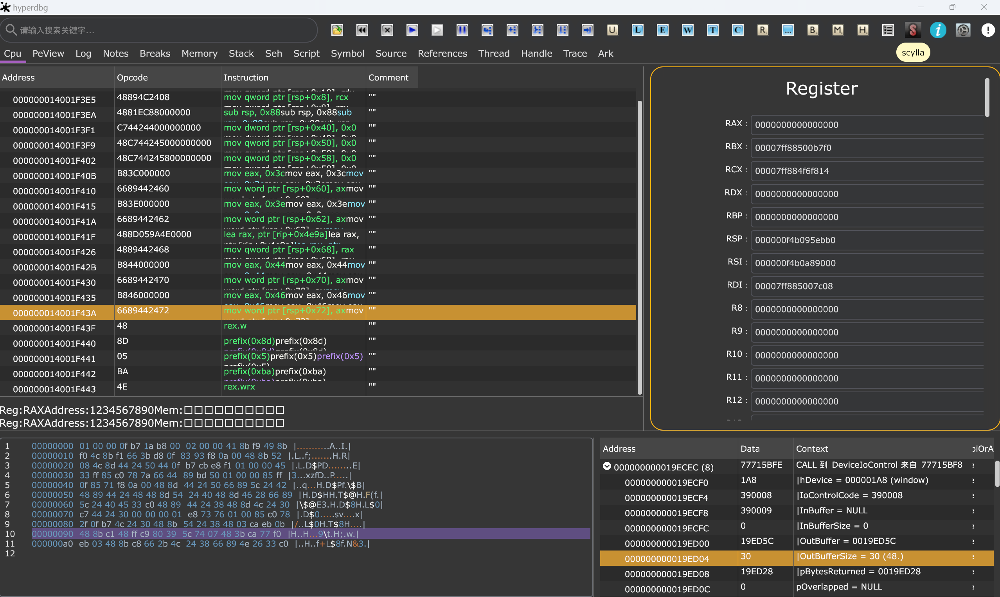

# gui
HyperDbg's Graphical User Interface (GUI)



old version of gui


 
how to build ?

```go
1. git clone https://github.com/HyperDbg/gui.git

2. install golang from https://go.dev/dl/
	
3. go run -x .
```